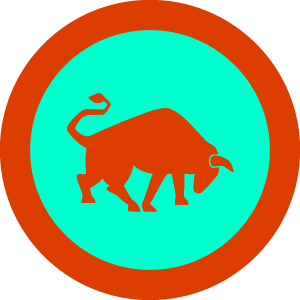
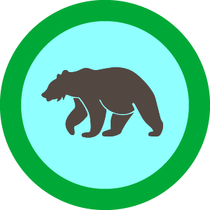
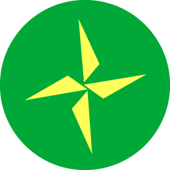
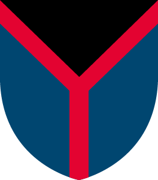
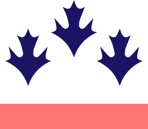
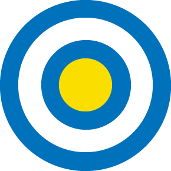
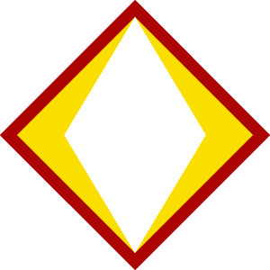
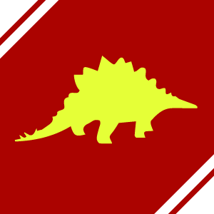

# Warglobe
Unity airplane and ship simulation on a planetary sphere.

My vision for this project is slow growth over a decade or so until a complete game is made for my accomplishment and amusement.

## Features Implemented
- Flight
- HUD
- Radar and line-of-sight system
- Automatic level flight

## Features Being Worked On
- Flotation
- Waypoints
- User interface
- Gameplay

## Controls
<table>
<thead>
<tr>
<th>Function</th>
<th>Control</th>
</tr>
</thead>
<tbody>
<tr>
<td>Bank left</td>
<td>left arrow (and joystick)</td>
</tr>
<tr>
<td>Bank right</td>
<td>right arrow (and joystick)</td>
</tr>
<tr>
<td>Pull up</td>
<td>down arrow (and joystick)</td>
</tr>
<tr>
<td>Pull down</td>
<td>up arrow (and joystick)</td>
</tr>
<tr>
<td>Yaw left</td>
<td>q (and joystick twist)</td>
</tr>
<tr>
<td>Yaw right</td>
<td>e (and joystick twist)</td>
</tr>
<tr>
<td>Accelerate</td>
<td>left shift (and throttle)</td>
</tr>
<tr>
<td>Decelerate</td>
<td>z (and throttle)</td>
</tr>
<tr>
<td>Cycle cameras</td>
<td>c</td>
</tr>
<tr>
<td>Planet view</td>
<td>m</td>
</tr>
<tr>
<td>Shoot laser</td>
<td>left ctrl</td>
</tr>
</tbody>
</table>

### Issues
This game is a work in progress. Certain elements noted below do not work yet; if it's on the list, I'm eventually fixing it.

#### Trivial Problems
- Translation strings do not work in game mode
- Some airplane parts don't collide with the ground
- Camera can pass through objects
- Aircraft wheel bays don't open
- Aircraft wheels have no suspension
- Airplane wheels are not correctly set in/out at game start
- Airplane throttle setting is not correct at game start

#### Functional Issues
- The planet view behaves strangely and cannot zoom
- The airplane will jitter and move continuously when landed
- The HUD view is still present in planet view
- Aircraft cannot land on aircraft carrier for lack of a tail hook implementation
- The FPV camera view is static when it should swivel inside the cockpit
- There is no flight path marker (FPM)
- Batteries cannot be recharged
	
#### Missing Features
- Multiplayer playability (waiting for Unity connected games)
- Decals and flags with country logos
- The player can change between vehicles
- Airplanes can mount bombs and missiles
- Pause screen and credits screen
- The player can earn new vehicles
- Include waypoint and city tags
- Aircraft carriers have elevators and hangars
- Give the game a goal (or levels)

## Intended Aesthetic

These images are for inspiration only.

## Factions

### Allied Coalition
#### Gomer

Demonym: Gomerag
Capital: Galic

#### Scythia

Demonym: Scyth
Capital: Ukra

### United Coalition
#### Javan

Demonym: Javanite
Capital: Elys

#### Tobolik

Demonym: Tabali
Capital: Tobolsk

### International Coalition
#### Meshchera
Demonym: Meschek
Capital: Meshkva

#### Thuras
Demonym: Thuran
Capital: Thur

#### Cush

Demonym: Cushite
Capital: Ethi

### Cosmopolitan Coalition
#### Mizr
Demonym: Mizraim
Capital: Mitz

#### Huttia
Demonym: Huttite
Capital: Hut

### Federal Coalition
#### Elam
Demonym: Elami
Capital: Eru

#### Asshuria

Demonym: Asshur
Capital: Ashkh

#### Arphaxia
Demonym: Arrhip
Capital: Chalda

### Joint Coalition
#### Lydda
Demonym: Sardi
Capital: Lydd

#### Aram
Demonym: Arami
Capital: Aramecc

### No Coalition/Rogue
#### Madesh

Demonym: Madai
Capital: Madapa

#### Palesti

Demonym: Philisim
Capital: Jebussa
